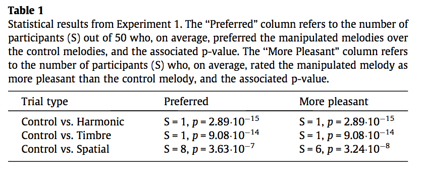

#### Article ID: DRaKS
#### Pilot: Kyle MacDonald
#### Start date: 7/11/17
#### End date: 10/19/17
#### CoPilot: Mike Frank

-------

#### Methods summary: 

On each trial, participants heard two melodies: a "control" melody that was not modified in any way and a "manipulated" melody where either the pitch, timbre, or spatial deviance was modified programatically. The dependent measures were two 2AFC measures with the following structures:

  1. "Which melody did you prefer" 
  2. "Which melody was more unpleasant?"

------

#### Target outcomes: 

For this article you should focus on the findings reported for Experiment 1 in section 2.2 (also refer to section 2.1.4.). Specifically, you should attempt to reproduce all descriptive and inferential analyses reported in the text below and associated tables/figures:

> As shown in Table 1, for each of the pitch, timbre and spatial deviant conditions, participants greatly preferred the control melodies to the altered melodies. There were no significant correlations between musical training and either the preference or pleasantness measures for any of the manipulation comparisons (all Pearson’s r’s < 0.2, all p’s > 0.20).

Here is the relevant table from the paper: 



------

```{r global_options, include=FALSE}
knitr::opts_chunk$set(echo=TRUE, warning=FALSE, message=FALSE)
```

## Step 1: Load packages

```{r}
library(tidyverse) # for data munging
library(knitr) # for kable table formating
library(haven) # import and export 'SPSS', 'Stata' and 'SAS' Files
library(readxl) # import excel files
library(CODreports) # custom report functions
library(magrittr) # for compound pipes
library(stringr) # for working with strings
library(BSDA) # for sign test
```

## Step 2: Load data

```{r}
d1 <- read_csv("data/data1.csv")
```

Check the structure of the data.

```{r}
glimpse(d1)
```

Check how many participants we have in the data file.

> Participants were 50 undergraduate students

The authors did not report filtering two participants in the paper, but there is an `Include` column that specifies that data from `r length(unique(d1$subjects[is.na(d1$Include)]))` participants is dropped. 

It looks like some trials are dropped from participant 51 and then all trials are dropped for 33 and 34.

```{r}
n_e1 <- 50

d1 %>% 
  filter(Include == 1) %>% 
  distinct(subjects) %>% 
  nrow() == n_e1
```

Do we have 72 trials for each participant? 

> Each participant completed 36 trials (12 melodies 3 deviant conditions) twice in a different random order each time, for a total of 72 trials.

```{r}
n_trials_e1 <- 72
n_participants <- 52

d1 %>% 
  group_by(subjects) %>% 
  count() %>% 
  mutate(full_data = n == n_trials_e1) %>% 
  pull(full_data) %>% 
  sum() == n_participants
```

Yes, but it looks like some data is filtered at the trial level, which is not mentioned in the paper. 

## Step 3: Tidy data

Data were already in a tidy format. But we need to remove the participants that were not included in the analyses. From the supplementary codebook:

> Include: Whether participant data were included (1) or excluded (0) from the analysis due to technical difficulties during data collection or withdrawal from the experiment.

```{r}
d_analysis <- d1 %>% 
  filter(Include == 1)
```

## Step 4: Run analysis

### Pre-processing

Average data for each participant and condition. From the analysis plan section:

> We averaged the responses across trials for each participant. This yielded (i) a proportion of trials on which participants preferred the manipulated stimulus, and (ii) a proportion of trials on which participants selected the manipulated stimulus as more pleasant.

Note that participants' responses were coded using a 0/1 dummy coding scheme:

> Preference: Binary response indicating whether (1) or not (0) the participant preferred the stimulus predicted by the Source-Dilemma Hypothesis. Unpleasantness: Binary response indicating whether (1) or not (0) the participant found more unpleasant the stimulus predicted by the Source-Dilemma Hypothesis

Note that this coding schedule is a bit underspecified since we have to know the predictions of the Source-Dilemma Hypothesis to map 1 and 0 to behaviors. Here's the relevant prediction from the paper: 

> We therefore predicted that manipulated melodies would be perceived as less pleasant than the standard melodies because listeners would encounter perceptual incoherence in the former.

```{r}
d_ss <- d_analysis %>% 
  mutate(manipulation = forcats::fct_relevel(
    forcats::fct_recode(manipulation, 
                        harmonic = "H", 
                        spatial = "S",
                        timbre = "T"), 
    "harmonic","timbre")) %>%
  group_by(subjects, manipulation) %>% 
  summarise(preference = mean(Preference),
            unpleasant = mean(Unpleasant))
```

Classify participants by whether they preferred the manipulated or non-manipulated melodies

> Because the proportion data were not normally distributed, subjects were classified as to whether they, on average, preferred the manipulated or non-manipulated melody.

I interpreted "on average" to mean $M_{score} <= 0.5$ since I think "1" was coded as preferring the manipulated melodies.

```{r}
d_ss %<>% 
  mutate(prefer_manipulated = ifelse(preference <= 0.5, TRUE, FALSE),
         pleasant_manipulated = ifelse(unpleasant <= 0.5, TRUE, FALSE))
```


### Descriptive statistics

Reproduce the values for S reported in Table 1. S refers to to the number of participants (s_preferred) out of 50 who, on average, preferred the manipulated melodies over the control melodies, and the number of participants (s_pleasant) who, on average, rated the manipulated melody as more pleasant than the control melody.

```{r}
table1 <- d_ss %>% 
  group_by(manipulation) %>% 
  summarise(n_prefer_manipulated= sum(prefer_manipulated),
            n_unpleasant_control = sum(pleasant_manipulated), 
            n = n())
  

table1 %>% kable()
```

MATCH. We were able to reproduce the reported values. 

### Inferential statistics

Perform hypothesis tests using the Sign test and BSDA package. 

> Sign tests as implemented in R (R Development Core Team, 2014) supple- mented with the BSDA package (Arnholt, 2012) were used to test whether the number of participants who exceeded an expected preference or pleasantness proportion of 0.5 was greater (or less) than expected by chance. This yields the S statistic, which is the number of participants above the expected median (i.e., with proportion scores >0.5 under the null hypothesis). Under the null hypothesis, S is equal to n/2. P-values represent the binomial probability of S statistics at least as extreme as that observed (Maxwell & Delaney, 2004).

We run `BSDA::SIGN.test` on the number of participants (out of the total, 50) who had a preference or pleasantness assignment above .5. We interpret "greater (or less)" to mean "two tailed".

For a single condition, this would look like:

```{r}
pref_timbre <- BSDA::SIGN.test(d_ss$prefer_manipulated[d_ss$manipulation == "timbre"], md= .5)
pref_timbre
```

This value is very close to (but not *exactly* the same as) the reported value. 

```{r}
compareValues(obtainedValue = pref_timbre$p.value, 
                          reportedValue = 9.08e-14, 
                          isP = TRUE)
```

Let's do this for the others, now, and compare.

Note that when we originally ran this we encountered major numerical errors. We contacted the authors and asked for assistance and they said that we should exclude "the participant who is exactly at chance" in the harmony condition. This does not appear to be specified in the paper. We think they must be referring to subject 6, so we exclude them below before carrying out the analysis

```{r}
p_table <- d_ss %>% 
  filter(subjects != 6) %>% # NB - authors advise we should exclude "the participant who is exactly at chance" This appears to be subject 6
  group_by(manipulation) %>% 
  summarise(p_preference = BSDA::SIGN.test(prefer_manipulated, md = 0.5, 
                                alternative = "two.sided")$p.value, 
            p_pleasant = BSDA::SIGN.test(pleasant_manipulated, md = 0.5, 
                                alternative = "two.sided")$p.value) 
kable(p_table, digits = 16)
```

Reprint the table:


Let's explictly compare the reported and obtained values below.

Preference:

```{r}
# Control vs. Harmonic preferred p.val
compareValues(reportedValue = 2.89e-15, 
              obtainedValue = p_table$p_preference[p_table$manipulation == "harmonic"], isP = T)

# Control vs. Timbre preferred p.val
compareValues(reportedValue = 9.08e-14, 
              obtainedValue = p_table$p_preference[p_table$manipulation == "timbre"], isP = T)

# Control vs. Spatial preferred p.val
compareValues(reportedValue = 3.63e-7, 
              obtainedValue = p_table$p_preference[p_table$manipulation == "spatial"], isP = T)
```


Pleasantness:

```{r}
# Control vs. Harmonic pleasant p.val
compareValues(reportedValue = 2.89e-15, 
              obtainedValue = p_table$p_pleasant[p_table$manipulation == "harmonic"])

# Control vs. Timbre pleasant p.val
compareValues(reportedValue = 9.08e-14, 
              obtainedValue = p_table$p_pleasant[p_table$manipulation == "timbre"])

# Control vs. Spatial pleasant p.val
compareValues(reportedValue = 3.24e-8, 
              obtainedValue = p_table$p_pleasant[p_table$manipulation == "spatial"])

```


INSUFFICIENT INFORMATION ERROR. I was unable to reproduce the correlational analyses because the musical training data was not included in the dataset. 

Note: we contacted the authors and requested the musical training data. They were unable to locate this data and believe it is lost.

## Step 5: Conclusion

```{r}
codReport(Report_Type = 'joint',
          Article_ID = 'DRaKS', 
          Insufficient_Information_Errors = 1,
          Decision_Errors = 0, 
          Major_Numerical_Errors = 5, 
          Minor_Numerical_Errors = 2, 
          Author_Assistance = TRUE)
```

We were able to reproduce the descriptive results for the preference and the unpleasantness measures. All the results were highly signficiant, but we encountered 5 major numerical differences for the $p$-values. The problems were not rectified by the authors instructions to exclude a participant from these analyses (this was not specified in the paper). In addition to the $p$-value differences, there was not enough information included in the dataset to reproduce the correlations between preference/pleasantness measures and participants' musical training. The authors were unable to locate this data and believe it is lost.

```{r session_info, include=TRUE, echo=TRUE, results='markup'}
devtools::session_info()
```
